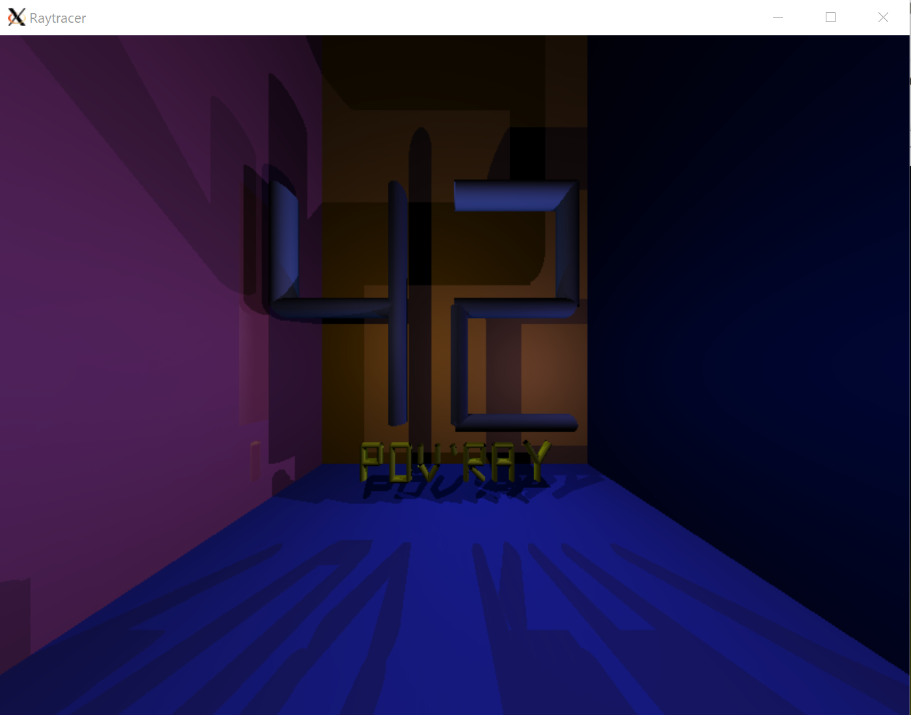

# Raytracer

Raytracer is a raytracing C executable. It generates images from text description by using the ray tracing rendering technique.



## Requirements

Building the Raytracer executable requires the following tools:
- X.org graphic system (see [www.x.org](https://www.x.org/wiki/))
```bash
sudo apt-get install xorg
```
- MiniLibX library (see [Installer la miniLibX](https://achedeuzot.me/2014/12/20/installer-la-minilibx/))

## Compilation

To build the executable, use:

```bash
make all
```

## Usage

To generate an image, it requires a scene description file.

```bash
./rt [SCENE-DESCRIPTION-FILE]
```

The text description must follow the grammar `TYPE | opt=value | opt=value | ...`.


### Window

The window option is:
- size=x,y

### Eyes

The eyes options are:
- position=x,y,z
- rotation=x,y,z

### Spots

The spots options are:
- position=x,y,z
- color=value

### Objects

There are 6 types of object: PLAN, SPHERE, CYLINDER, CONE, PARABOLOID or HYPERBOLOID.

The options are:
- color=value
- index=value
- position=x,y,z
- rotation=x,y,z
- radius=value
- constant=value
- gloss=value
- transparency=value
- reflection=value
- limit_min_x=value
- limit_max_x=value
- limit_min_y=value
- limit_max_y=value
- limit_min_z=value
- limit_max_z=value

### Types values

The color values are: RED, LIME, NAVY, TEAL, GREY, BLUE, PINK, AQUA, BLACK, GREEN, OLIVE, WHITE, SILVER, MAROON, PURPLE, ORANGE, YELLOW or FUCHSIA.

The index values are: EMPTY, ICE, ALCOHOL, CRYSTAL, WATER, PYREX, GLASS, AGATE, QUARTZ, EMERALD, RUBY, SAPPHIRE or DIAMOND.

### Example

```bash
WINDOW | size=800,600

EYE | position=-200,0,80 | rotation=20,0,0

PLAN | color=0x0000FF | position=0,0,-150 | gloss=0.6 | index=WATER
SPHERE | color=SILVER | position=0,0,10 | rotation=55,-50,0 | radius=120 | gloss=0.5 | limit_max_z=0 | reflection=0.24
CYLINDER | color=pink | position=15,-500,0 | rotation=15,0,0 | limit_max_z=100 | radius=45 | gloss=0.4
CONE | color=0xFFFF00 | position=0,200,40 | rotation=15,0,0 | constant=0.09 | gloss=0.3 | limit_min_z=0 | index=0.42
HYPERBOLOID | color=GREEN | position=0,100,0 | rotation=0,0,45 | constant=0.4 | limit_min_x=200 | gloss=0.3
PARABOLOID | color=aqua | position=0,0,-100 | rotation=180,0,0 | constant=50 | transparency=0.65 | gloss=0.3

SPOT | position=-200,109,150 | color=blue
SPOT | position=-150,-200,100 | color=RED
SPOT | position=-250,-500,90 | color=0xFFFF00
```

Some other examples are available in [`scenes/`](scenes/)

## License

Distributed under the [Apache License, Version 2.0](http://www.apache.org/licenses/). See [`LICENSE`](LICENSE) for more information.
