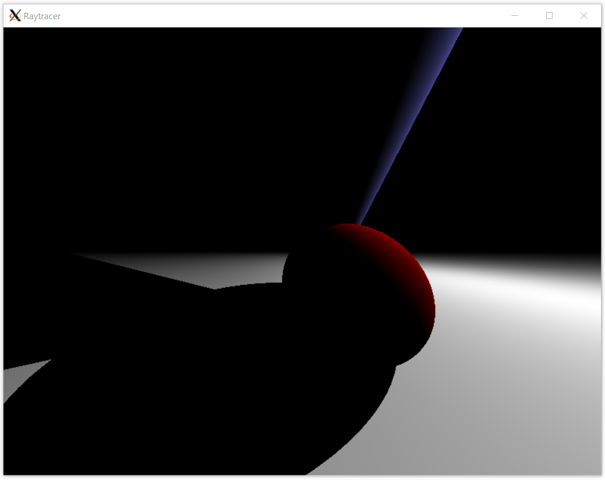
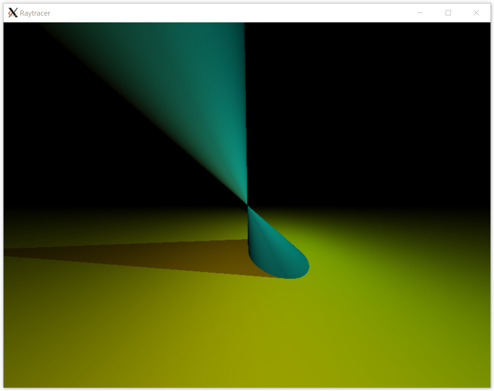
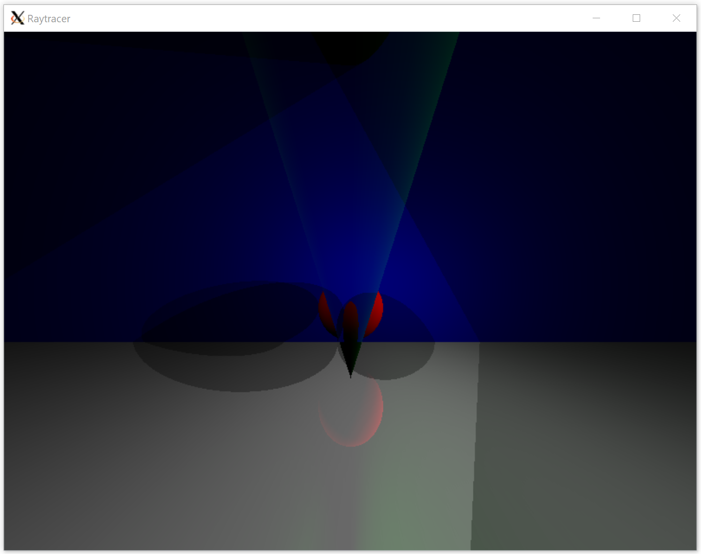
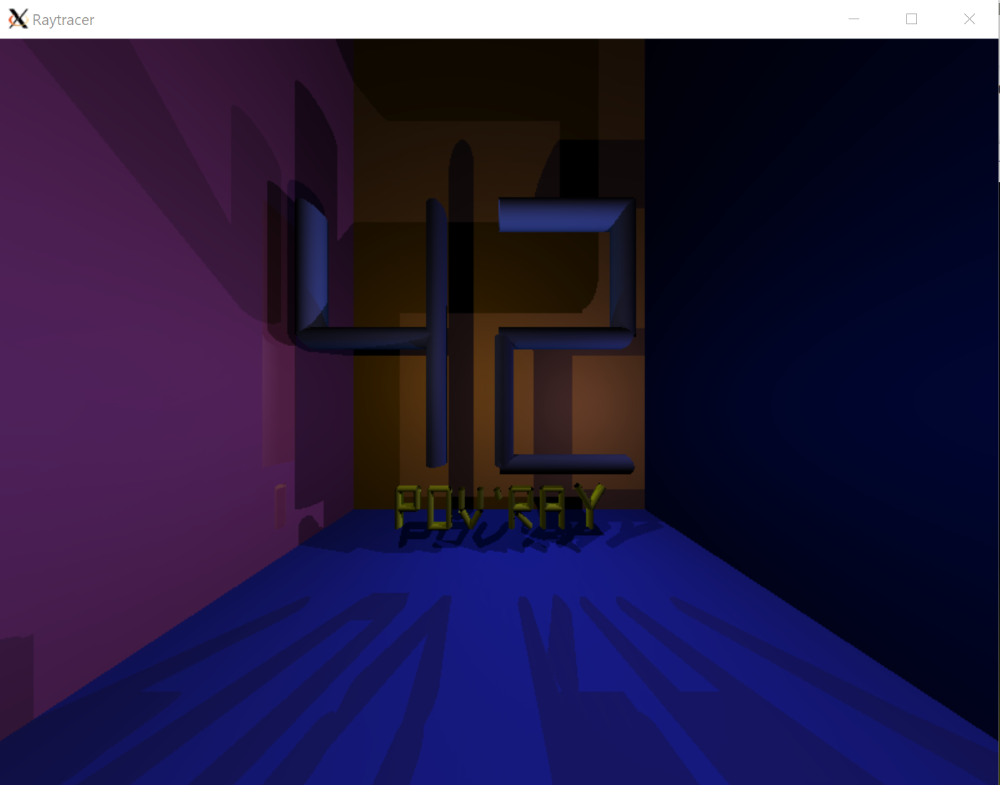

# Raytracer [](https://travis-ci.org/kortescode/Raytracer)

Raytracer is a raytracing C executable. It generates images from text description by using the ray tracing rendering technique.

  

## Requirements

Building the Raytracer executable requires the following tools:
- X.org graphic system (see [www.x.org](https://www.x.org/wiki/))
```bash
sudo apt-get install xorg
```
- MiniLibX library (see [Installer la miniLibX](https://achedeuzot.me/2014/12/20/installer-la-minilibx/))

## Compilation

To build the executable, use:

```bash
make all
```

## Usage

To generate an image, it requires a scene description file.

```bash
./rt [SCENE-DESCRIPTION-FILE]
```

The text description must follow the grammar `TYPE | opt=value | opt=value | ...`.


### Window

The window option is:
- size=x,y

### Eyes

The eyes options are:
- position=x,y,z
- rotation=x,y,z

### Spots

The spots options are:
- position=x,y,z
- color=value

### Objects

There are 6 types of object: PLAN, SPHERE, CYLINDER, CONE, PARABOLOID or HYPERBOLOID.

The options are:
- color=value
- index=value
- position=x,y,z
- rotation=x,y,z
- radius=value
- constant=value
- gloss=value
- transparency=value
- reflection=value
- limit_min_x=value
- limit_max_x=value
- limit_min_y=value
- limit_max_y=value
- limit_min_z=value
- limit_max_z=value

### Types values

The color values are: RED, LIME, NAVY, TEAL, GREY, BLUE, PINK, AQUA, BLACK, GREEN, OLIVE, WHITE, SILVER, MAROON, PURPLE, ORANGE, YELLOW or FUCHSIA.

The index values are: EMPTY, ICE, ALCOHOL, CRYSTAL, WATER, PYREX, GLASS, AGATE, QUARTZ, EMERALD, RUBY, SAPPHIRE or DIAMOND.

### Example

```bash
./rt scenes/scene_42
```



Some other examples are available in [`scenes/`](scenes/)

## License

Distributed under the [Apache License, Version 2.0](http://www.apache.org/licenses/). See [`LICENSE`](LICENSE) for more information.
